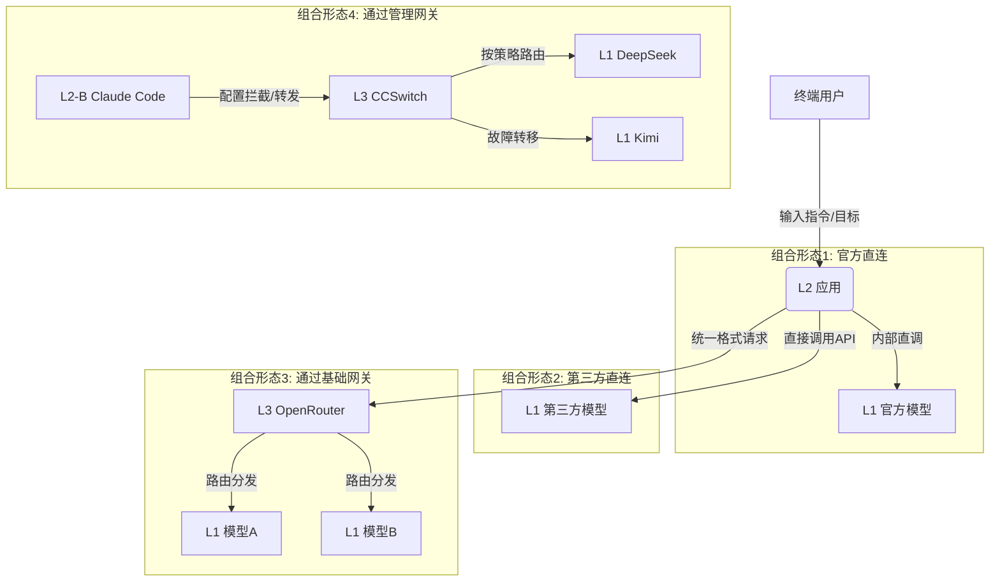

# 05 · 商业模式与数据流向

> 分层不只是为了认知，更是为了看懂钱怎么赚、数据怎么流。本页拆解每一层的生意经。

---

## 一、各层级商业模式

| 层级 / 角色 | 主要商业模式 | 盈利来源 |
| :--- | :--- | :--- |
| **L1 模型厂商** | API 计费 / 闭源售卖 | 按 Token 数量收费（输入 / 输出分别计价）；或提供私有化部署 |
| **L2-A 官方应用** | 订阅制 | 月付 / 年付会员费，提供不同模型权限和额度 |
| **L2-B 智能体应用** | 订阅制 / 按结果计费 | 按月订阅；或按成功执行的任务次数 / 代码行数计费 |
| **L3 聚合网关** | 加价抽成 / 会员费 | 在上游模型成本基础上加价转售；或收取固定会员费提供无限 / 折扣额度 |
| **L3 管理工具** | 软件买断 / 开源捐助 | 作为开发者工具，一次性售卖或开源接受赞助 |

**关键洞察**：
- L1 卖的是"算力 + 智能"，按量计费是主流。
- L2 卖的是"体验 + 成果"，订阅制占主导，L2-B 正探索按结果计费。
- L3 卖的是"调度 + 保障"，赚的是差价或工具费。

---

## 二、数据流向图解

---

## 三、四种组合形态对比

| 形态 | 路径 | 优点 | 缺点 |
| :--- | :--- | :--- | :--- |
| **官方直连** | 用户 → L2 → L1（自家） | 体验一体化，调优深 | 被单一厂商锁定 |
| **第三方直连** | 用户 → L2 → L1（第三方） | 可选模型多 | 需自行管理多个 Key |
| **基础网关** | 用户 → L2 → L3 → L1 | 一个接口调多家，成本可控 | 多一跳延迟，依赖网关可用性 |
| **管理网关** | 用户 → L2-B → L3（配置） → L1 | 故障转移、用量统计、热切换 | 配置复杂度上升 |

---

← [上一篇：04 · 横向维度扩展](./04-extensions.md) | [返回首页](../README.md) | 下一篇：[06 · 局限性与风险分析 →](./06-risks.md)
